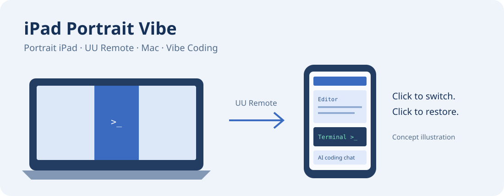

# iPad Portrait Vibe

**用竖屏 iPad 通过网易 UU 远程控制 Mac，方便做 Vibe Coding 的一键桌面切换工具。**

[English](README.md) · [下载与版本发布](https://github.com/Jhe1004/ipad-portrait-vibe/releases)



## 为什么做这个软件

我习惯把 iPad 竖着使用，也经常通过 UU 远程控制 MacBook，使用 AI 编程工具做 Vibe Coding。把横向的电脑桌面放进竖着的 iPad 后，上下往往留下较大空白，编辑器、终端和对话窗口也显得偏小。

这个软件的功能很简单：点击一次，把 Mac 桌面切成适合竖屏 iPad 的形状；再点一次，恢复原来的显示设置。UU 仍然负责远程连接，这个软件只负责切换桌面。

## v0.3.0 的清晰度改进

旧版的实际画面只有 744 × 1134 像素，放大到 iPad 后文字容易偏软。v0.3.0 修正虚拟屏幕的 HiDPI 模式参数：保持文字和窗口的工作区大小，使用每个方向 2 倍的像素生成画面，总像素数达到旧版的 4 倍。程序会检查实际像素密度，未进入高清模式时自动恢复，不会把低清模式当作成功。

Mac 端已验证 744 × 1134 逻辑尺寸、1488 × 2268 像素和 2 倍缩放。尚不能据此保证 UU 在每种网络或画质设置下都会传输全部像素。

## 安装和使用

1. 在 **Releases** 下载 ZIP，解压后，把 **iPad Portrait Vibe.app** 拖进 Mac 的“应用程序”文件夹。应用可以独立运行，不需要保留源码目录。
2. 在 iPad 上通过 UU 连接 Mac，保持 iPad 竖屏。
3. 打开应用，点击 **“切换到 iPad 竖屏”**。
4. 检查画面和点击位置。如果 UU 仍显示横屏，在它提供的显示器选择入口中查看是否出现 **“iPad Portrait Vibe”**，并选中它。入口位置以实际客户端为准。
5. 画面正常时，点击 **“画面正常，保持竖屏”**。未确认时，程序会在约 **120 秒**后自动恢复。
6. 需要回到正常桌面时，再点 **“恢复正常电脑模式”**。关闭应用也会请求恢复。

菜单栏也提供切换入口和“恢复并退出”，方便在窗口被其他程序遮住时操作。

## 目前支持到什么程度

| 项目 | 当前情况 |
| --- | --- |
| 系统 | 最低构建目标为 macOS 14；已测试 macOS 26.5，其他版本尚需验证。 |
| Mac | 提供 arm64 和 x86_64 的通用程序；实际运行测试使用 M4 MacBook Air，尚未在 Intel Mac 上实测。 |
| 显示器 | 当前支持一块屏幕，切换前需关闭已有镜像。发现多屏时会取消切换。 |
| iPad | 默认比例按 iPad mini 7 设计，其他尺寸可能仍有少量空白。 |
| 桌面模式 | **744 × 1134 逻辑工作区 / 1488 × 2268 实际像素，Retina 2 倍缩放**。本机已验证高清模式及恢复；UU 端效果仍受它的画质与码率设置影响。 |
| UU 适配 | 作者反馈，原型在自己的 iPad mini 7 + UU 场景中使用正常；这不能替代其他设备和客户端版本的验证。 |

切换后，Mac 的实体横屏两侧可能出现空白，这是实体屏幕与竖屏桌面的比例不同造成的。软件希望改善的是远程 iPad 的竖屏工作区。

## 第一次打开下载的应用

首个公开测试版使用本地临时签名，**没有 Apple Developer ID 签名和公证**。下载后可能被 macOS 拦截。如果你信任源码并核对过文件，可按 [Apple 官方说明](https://support.apple.com/en-us/102445)操作，或从源码自行构建。项目不会要求全局关闭 Gatekeeper。

发布附件提供 `SHA256SUMS.txt`，可核对下载文件是否完整。后续如具备开发者签名条件，可进一步完成签名与公证；目前不会把临时签名说成苹果认证。

## 从源码构建

安装 Apple 的 Xcode Command Line Tools 后执行：

```bash
git clone https://github.com/Jhe1004/ipad-portrait-vibe.git
cd ipad-portrait-vibe
bash build.sh
open "build/iPad Portrait Vibe.app"
```

执行 `bash package.sh` 可生成通用 ZIP 和校验文件。GitHub Actions 只构建与打包，不运行会改变显示设置的测试。

## 恢复机制与本地数据

程序先保存原显示设置，再创建竖屏虚拟屏幕。辅助进程负责倒计时和持有虚拟屏幕；恢复时，程序等待系统真正恢复后才显示成功。控制管道关闭或父进程丢失时，会请求恢复。配置只申请在程序存活期间生效。

恢复记录保存在：

```text
~/Library/Application Support/iPad Portrait Vibe/01_runs/
```

每次运行都会创建新的编号文件夹。这些记录包含显示设置和本地显示器标识。应用没有网络或遥测代码，也不录制屏幕；UU 的权限与隐私行为由 UU 自己负责。需要反馈问题时，请先检查并脱敏本地记录。

## 技术与限制

软件使用原生 Cocoa 窗口、公开的 CoreGraphics 显示配置接口，以及 **macOS 非公开的 `CGVirtualDisplay` 接口**。启动切换前会检查接口是否存在，但 macOS 更新仍可能改变行为。

这是一份功能范围较小的早期测试版，尚未覆盖所有睡眠唤醒、扩展坞、多屏插拔和强制终止情形。如果恢复异常，可以在“系统设置 → 显示器”中选择正常模式。本地恢复记录会保留。

技术路线参考 [Chromium 的 macOS 虚拟显示测试](https://chromium.googlesource.com/chromium/src/+/HEAD/ui/display/mac/test/virtual_display_util_mac.mm)。测试范围详见 [测试说明](docs/TESTING.md)。

## 反馈与许可证

欢迎提交 Issue，说明 Mac 型号、macOS 版本、iPad 型号、UU 版本，以及画面或点击位置的问题。不要上传账号密码或未经脱敏的诊断记录。

MIT 开源许可证。本项目独立开发，与 Apple 和网易没有隶属或官方合作关系。
